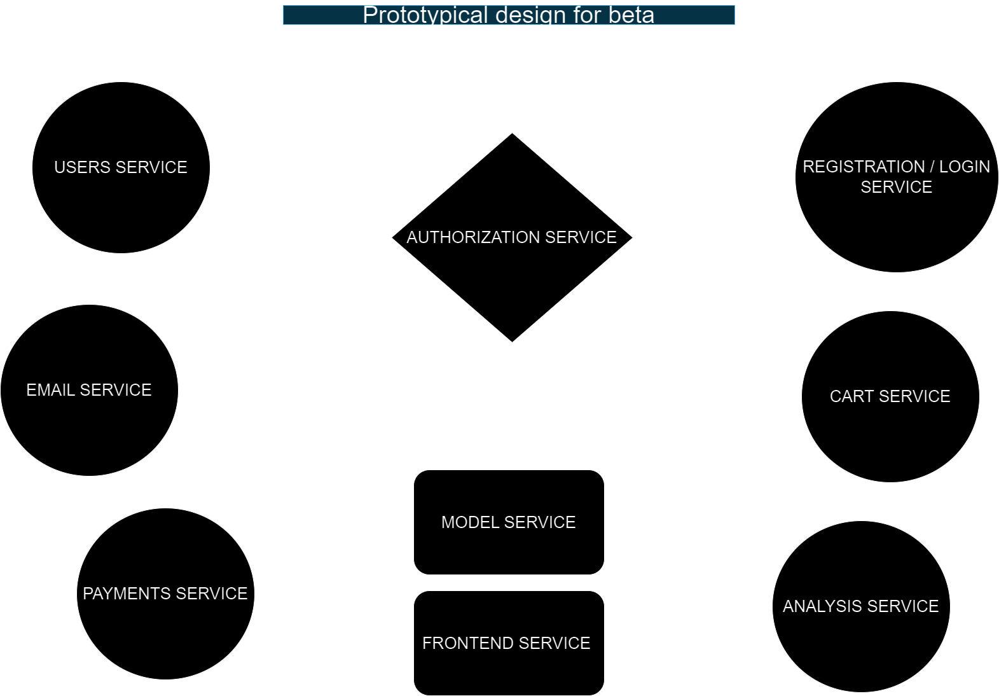

# Sentiment-Insights

Fastify-based sentiment analysis API leveraging Python AI on Google Cloud Platform (GCP). Offers high scalability and performance for analyzing text sentiment in real-time.

### What am I trying to implement?

I am developing an innovative application centered around a startup concept. The app enables users to harness the power of a paid API to deeply analyze their reviews. By simply inputting JSON data, the application's advanced model swiftly evaluates the information, providing valuable insights and opinions.

To ensure seamless scalability, I've strategically opted for MongoDB and Redis as our databases, with each service having its dedicated database. Leveraging the robust infrastructure of Google Cloud for hosting, our architecture is designed for optimal performance and growth potential.

This project embodies the essence of microservices architecture, employing Helm charts, Kubernetes customization, and Skaffold for streamlined deployment and management. It's not just an app; it's a sophisticated solution poised to revolutionize how businesses interpret and leverage their customer feedback.

## Services Diagram

### Services Description:

| Service                | Description                                                                                                        |
|------------------------|--------------------------------------------------------------------------------------------------------------------|
| Users Service          | Manages user accounts, profiles, and related information. |
| Authorization Service  | Ensures secure access to resources within the application. Handles authorization and session management. |
| Email Service          | Sends transactional emails for account verification, password reset, and other user communications.             |
| Model Service          | Hosts the Python-based sentiment analysis model. Exposes an interface for real-time sentiment analysis of text inputs. |
| Payments Service       | Handles user payments for accessing premium features or subscriptions. |
| Cart Service           | Processes orders.                         |
| Registration/Login Service | Handles user registration, login, and authentication. Allows users to create accounts and access restricted features. |
| Analysis Service       | Performs sentiment analysis on text inputs in real-time. Utilizes the sentiment analysis model hosted in the Model Service. |
| Frontend Service       | Represents the user interface of the application. Provides web pages, forms, and UI components for user interaction. |

## Communication between Services

For communication between services, NATS will be used as a queue pub/sub to update events. NATS is a lightweight and highly performant messaging system that provides reliable communication between distributed systems.

### How it Works:

1. **Publisher-Subscriber Model**:
   - Services can publish messages (events) to specific topics.
   - Subscribing services can receive messages from these topics.
   - This decouples the sender and receiver, allowing for asynchronous communication between services.

2. **Update Events**:
   - Services can publish update events to notify other services about changes or updates in the system.
   - Subscribing services can listen for these events and react accordingly, enabling real-time updates across the application.

3. **Scalability and Reliability**:
   - NATS is designed for high scalability and reliability, making it suitable for handling communication between microservices in distributed environments.

### Example Usage:

- **Registration/Login Service**: Publishes user-related events such as user registration.